# JJM Brain HRMS - Model Map

## 1. Current Status

These models are **scaffolds**, not final full production models.

They are real Laravel Eloquent model classes, and many already contain relationship methods and casts, but they are not complete because:

- Most matching migrations are not created yet.
- Database columns are not finalized.
- Validation rules are not added.
- Policies are not added.
- Business logic is not added.
- Some relationships may be adjusted when migrations are designed.

So treat this document as a **model relationship map for planning and development**, not the final database ER diagram.

---

## 2. Big Picture

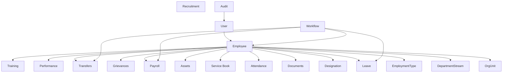

---

## 3. Super Master And Access

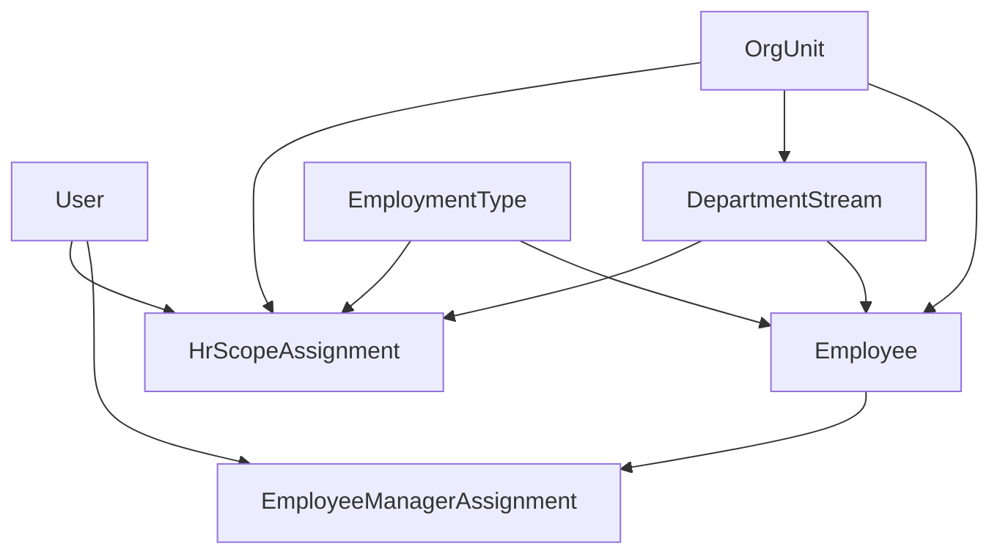

| Model | Purpose |
|---|---|
| User | Login identity for Super Admin, HR, and Employee users |
| OrgUnit | Government hierarchy: department, head office, zone, circle, division, sub-division, office |
| DepartmentStream | PHED/JJM classification |
| OrgUnit ↔ DepartmentStream | Defines which streams are available under each organization unit |
| EmploymentType | Regular/Contractual classification |
| HrScopeAssignment | Defines what an HR user can manage |
| EmployeeManagerAssignment | Special exception assignment of an employee to a user |

---

## 4. Employee Core

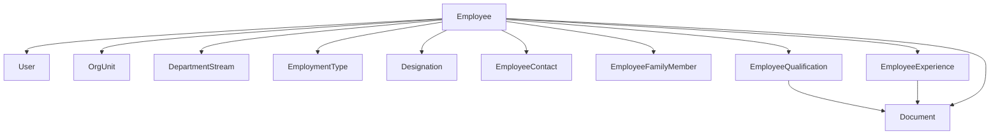

| Model | Purpose |
|---|---|
| Employee | Main employee profile |
| EmployeeContact | Contact and address details |
| EmployeeFamilyMember | Family, dependent, nominee details |
| EmployeeQualification | Education records |
| EmployeeExperience | Previous experience records |
| Cadre | Cadre master |
| Designation | Designation master |

---

## 5. Documents

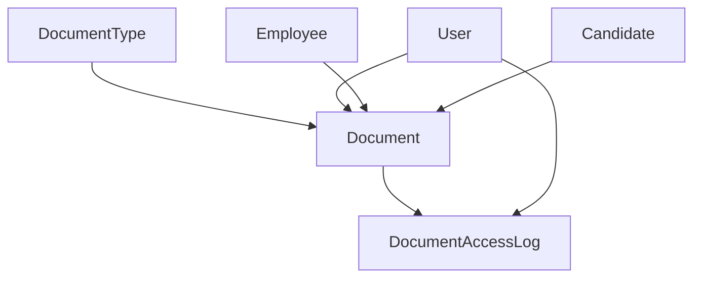

| Model | Purpose |
|---|---|
| DocumentType | Aadhaar, PAN, appointment letter, certificate, etc. |
| Document | Polymorphic uploaded document record |
| DocumentAccessLog | Tracks document preview/download/access |

---

## 6. Attendance

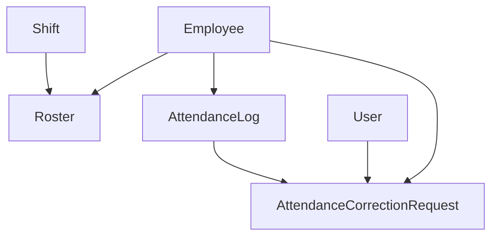

| Model | Purpose |
|---|---|
| Shift | Shift timing and attendance rules |
| Roster | Employee shift assignment by date |
| AttendanceLog | Daily attendance record |
| AttendanceCorrectionRequest | Correction request and approval |

---

## 7. Leave

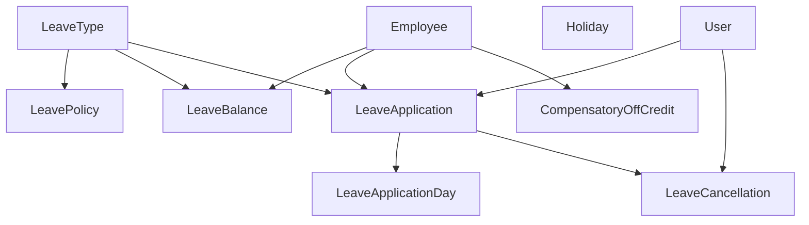

| Model | Purpose |
|---|---|
| LeaveType | Casual, earned, medical, maternity, etc. |
| LeavePolicy | Rules for each leave type |
| LeaveBalance | Employee leave balance |
| LeaveApplication | Employee leave request |
| LeaveApplicationDay | Date-wise breakdown |
| LeaveCancellation | Cancellation request |
| CompensatoryOffCredit | Comp-off credits |
| Holiday | Holiday calendar |

---

## 8. Payroll

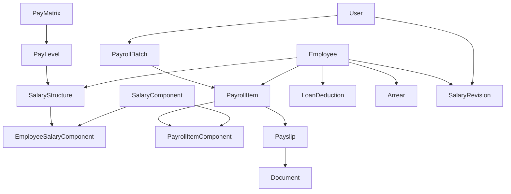

| Model | Purpose |
|---|---|
| PayMatrix | Government pay matrix master |
| PayLevel | Pay level under a matrix |
| SalaryStructure | Employee salary structure |
| SalaryComponent | Basic, DA, HRA, deduction, etc. |
| EmployeeSalaryComponent | Employee-specific salary component |
| PayrollBatch | Monthly payroll batch |
| PayrollItem | Employee payroll row inside a batch |
| PayrollItemComponent | Component-wise payroll details |
| Payslip | Generated payslip |
| LoanDeduction | Loan recovery |
| Arrear | Arrear records |
| SalaryRevision | Salary change history |

---

## 9. Service Book And Transfers

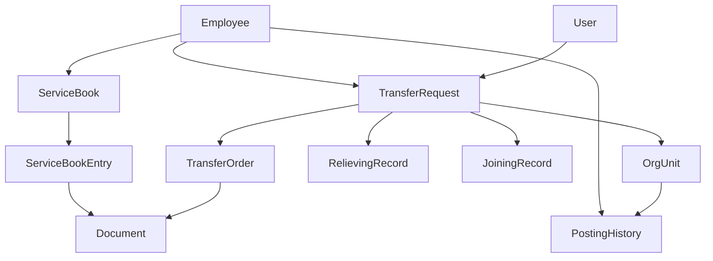

| Model | Purpose |
|---|---|
| ServiceBook | Employee digital service book |
| ServiceBookEntry | Joining, promotion, transfer, increment, retirement entries |
| TransferRequest | Transfer workflow request |
| TransferOrder | Generated transfer order |
| RelievingRecord | Relieving details |
| JoiningRecord | Joining details |
| PostingHistory | Employee posting history |

---

## 10. Workflow

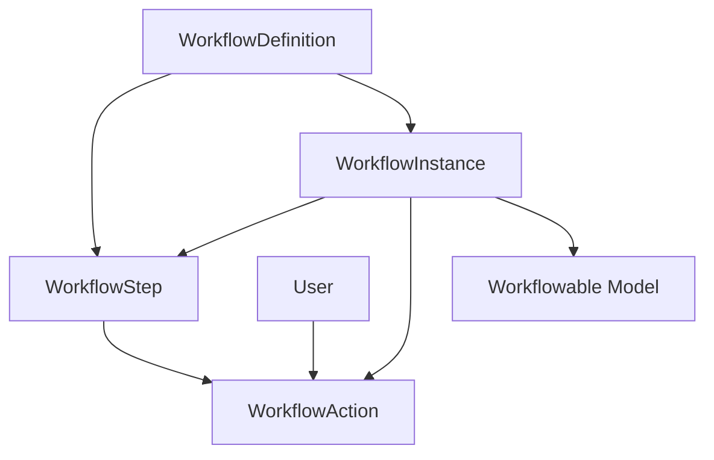

| Model | Purpose |
|---|---|
| WorkflowDefinition | Workflow setup for leave, transfer, payroll, etc. |
| WorkflowStep | Approval step |
| WorkflowInstance | Running workflow for a record |
| WorkflowAction | Approve/reject/return/escalate action |

---

## 11. Assets

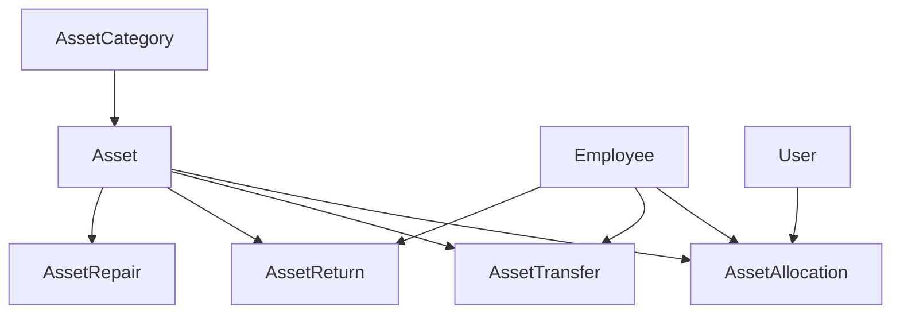

| Model | Purpose |
|---|---|
| AssetCategory | Laptop, phone, vehicle, equipment, etc. |
| Asset | Inventory item |
| AssetAllocation | Asset assignment |
| AssetTransfer | Asset movement |
| AssetReturn | Asset return |
| AssetRepair | Repair/maintenance record |

---

## 12. Grievances

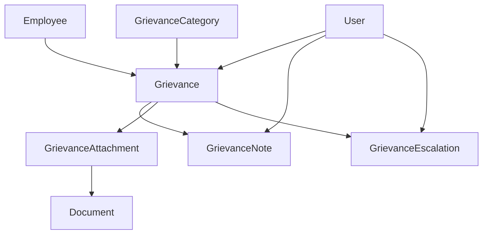

| Model | Purpose |
|---|---|
| GrievanceCategory | Grievance category master |
| Grievance | Employee complaint/ticket |
| GrievanceNote | Investigation/resolution notes |
| GrievanceAttachment | Attached documents |
| GrievanceEscalation | Escalation history |

---

## 13. Recruitment

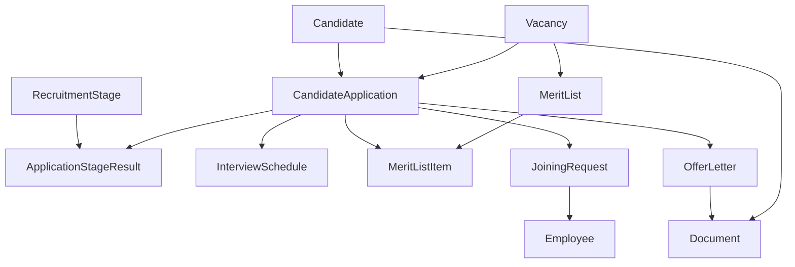

| Model | Purpose |
|---|---|
| Vacancy | Vacancy or job opening |
| Candidate | Candidate profile |
| CandidateApplication | Candidate application for vacancy |
| RecruitmentStage | Screening, exam, interview, etc. |
| ApplicationStageResult | Stage-wise candidate result |
| InterviewSchedule | Interview schedule |
| MeritList | Merit list |
| MeritListItem | Candidate row in merit list |
| OfferLetter | Offer letter |
| JoiningRequest | Candidate joining process |

---

## 14. Performance And Training

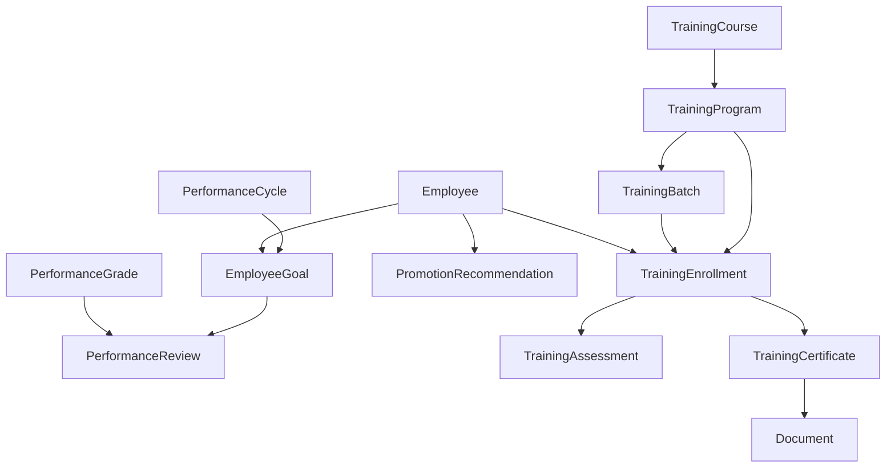

| Model | Purpose |
|---|---|
| PerformanceCycle | Annual/review cycle |
| EmployeeGoal | Employee goal/KPI |
| PerformanceReview | Review record |
| PerformanceGrade | Grade master |
| PromotionRecommendation | Promotion recommendation |
| TrainingCourse | Course master |
| TrainingProgram | Training program |
| TrainingBatch | Scheduled batch |
| TrainingEnrollment | Employee enrollment |
| TrainingAssessment | Assessment result |
| TrainingCertificate | Certificate record |

---

## 15. Notifications, Audit, And Integration

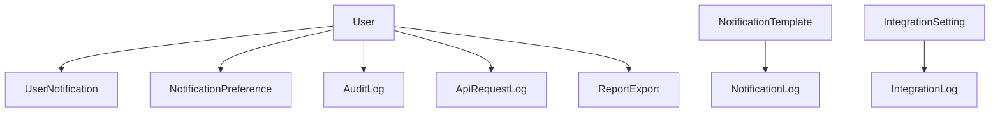

| Model | Purpose |
|---|---|
| NotificationTemplate | Template master |
| NotificationLog | Sent notification log |
| UserNotification | In-app notification |
| NotificationPreference | User notification settings |
| AuditLog | Auditable activity log |
| ApiRequestLog | API request log |
| IntegrationSetting | External integration settings |
| IntegrationLog | External integration activity log |
| ReportExport | Queued/exported report file |

---

## 16. Model Method Inventory

| Model | Relationship / Public Methods |
|---|---|
| ApiRequestLog | user |
| ApplicationStageResult | candidateApplication, recruitmentStage |
| Arrear | employee |
| Asset | assetCategory, allocations, transfers, returns, repairs |
| AssetAllocation | asset, employee, allocatedBy |
| AssetCategory | assets |
| AssetRepair | asset |
| AssetReturn | asset, employee |
| AssetTransfer | asset, fromEmployee, toEmployee |
| AttendanceCorrectionRequest | employee, attendanceLog, approvedBy |
| AttendanceLog | employee, correctionRequests |
| AuditLog | actor, auditable |
| Cadre | designations |
| Candidate | applications, documents |
| CandidateApplication | candidate, vacancy, stageResults, interviewSchedules, offerLetter, joiningRequest |
| CompensatoryOffCredit | employee |
| DepartmentStream | orgUnits, hrScopeAssignments, employees |
| Designation | cadre, departmentStream, employees |
| DeviceSession | user |
| Document | documentable, documentType, uploadedBy, verifiedBy, accessLogs |
| DocumentAccessLog | document, user |
| DocumentType | documents |
| Employee | user, orgUnit, departmentStream, employmentType, designation, contacts, familyMembers, qualifications, experiences, documents, attendanceLogs, leaveApplications, leaveBalances, payrollItems, serviceBook, transferRequests, postingHistories, assetAllocations, grievances, salaryStructures, loanDeductions, arrears, salaryRevisions, trainingEnrollments, compensatoryOffCredits, goals |
| EmployeeContact | employee |
| EmployeeExperience | employee, document |
| EmployeeFamilyMember | employee |
| EmployeeGoal | employee, performanceCycle, review |
| EmployeeManagerAssignment | user, employee, assignedBy |
| EmployeeQualification | employee, document |
| EmployeeSalaryComponent | salaryStructure, salaryComponent |
| EmploymentType | hrScopeAssignments, employees |
| Grievance | employee, grievanceCategory, assignedTo, notes, attachments, escalations |
| GrievanceAttachment | grievance, document |
| GrievanceCategory | grievances |
| GrievanceEscalation | grievance, escalatedTo |
| GrievanceNote | grievance, createdBy |
| Holiday | No relationship methods yet |
| HrScopeAssignment | user, orgUnit, departmentStream, employmentType |
| IntegrationLog | No relationship methods yet |
| IntegrationSetting | No relationship methods yet |
| InterviewSchedule | candidateApplication |
| JoiningRecord | transferRequest, joinedBy |
| JoiningRequest | candidateApplication, employee |
| LeaveApplication | employee, leaveType, approvedBy, days, cancellations |
| LeaveApplicationDay | leaveApplication |
| LeaveBalance | employee, leaveType |
| LeaveCancellation | leaveApplication, requestedBy, approvedBy |
| LeavePolicy | leaveType, employmentType |
| LeaveType | leaveBalances, leaveApplications, policies |
| LoanDeduction | employee |
| LoginHistory | user |
| MeritList | vacancy, items |
| MeritListItem | meritList, candidateApplication |
| NotificationLog | notificationTemplate, notifiable |
| NotificationPreference | user |
| NotificationTemplate | logs |
| OfferLetter | candidateApplication, document |
| OrgUnit | parent, children, departmentStreams, hrScopeAssignments, employees |
| OtpToken | user |
| PayLevel | payMatrix, salaryStructures |
| PayMatrix | payLevels |
| PayrollBatch | generatedBy, approvedBy, items |
| PayrollItem | payrollBatch, employee, components, payslip |
| PayrollItemComponent | payrollItem, salaryComponent |
| Payslip | payrollItem, document |
| PerformanceCycle | goals |
| PerformanceGrade | reviews |
| PerformanceReview | employeeGoal, performanceGrade, reviewedBy |
| PostingHistory | employee, orgUnit |
| PromotionRecommendation | employee, recommendedBy, approvedBy |
| RecruitmentStage | results |
| RelievingRecord | transferRequest, relievedBy |
| ReportExport | requestedBy |
| Roster | employee, shift |
| SalaryComponent | employeeSalaryComponents, payrollItemComponents |
| SalaryRevision | employee, approvedBy |
| SalaryStructure | employee, payLevel, employeeSalaryComponents |
| ServiceBook | employee, entries |
| ServiceBookEntry | serviceBook, document, createdBy, verifiedBy |
| Shift | rosters |
| TrainingAssessment | trainingEnrollment |
| TrainingBatch | trainingProgram, enrollments |
| TrainingCertificate | trainingEnrollment, document |
| TrainingCourse | programs |
| TrainingEnrollment | trainingProgram, employee, trainingBatch |
| TrainingProgram | enrollments, trainingCourse, batches |
| TransferOrder | transferRequest, document |
| TransferRequest | employee, fromOrgUnit, toOrgUnit, initiatedBy, order, relievingRecord, joiningRecord |
| User | canAccessPanel, hrScopeAssignments, employee, employeeManagerAssignments, loginHistories, deviceSessions, notifications |
| UserNotification | user |
| Vacancy | orgUnit, applications, meritLists |
| WorkflowAction | workflowInstance, workflowStep, actedBy |
| WorkflowDefinition | steps, instances |
| WorkflowInstance | workflowable, workflowDefinition, currentStep, actions |
| WorkflowStep | workflowDefinition, actions |

---

## 17. Next Step

The next practical step is to design migrations one module at a time.

Recommended first migration group:

```text
employees
employee_contacts
employee_family_members
employee_qualifications
employee_experiences
document_types
documents
```

Do not generate all migrations at once. Build and verify one module group at a time.
