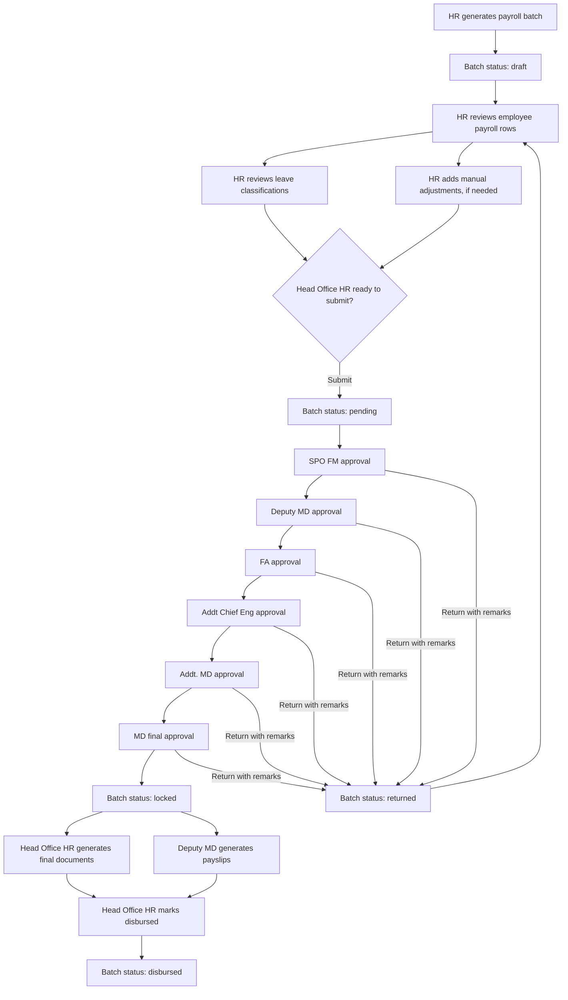
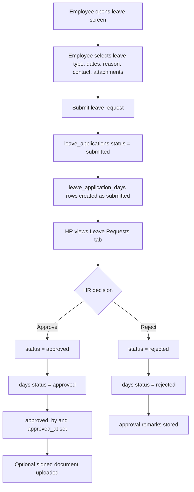
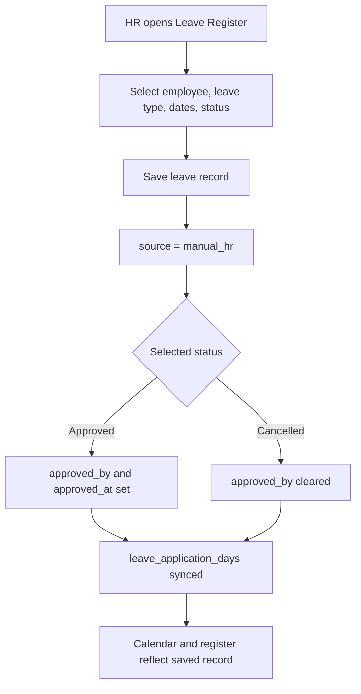
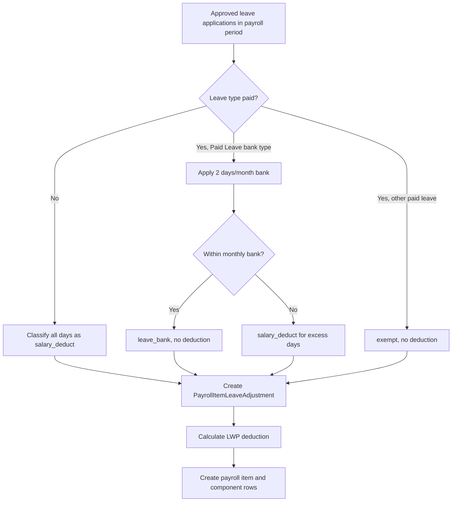

# Payroll And Leave Flow

This document explains the implemented flow for the Payroll and Leave modules:

- who acts at each stage
- which role is allowed to act
- which status changes happen
- which code owns the behavior

It is written for developers and functional reviewers who need to understand the flow without reading every Livewire component first.

## Common Actors

| Actor / role | How it is identified | Main responsibility |
|---|---|---|
| Employee | `users.is_admin = false` and `users.is_hr = false`, linked through `users.employee` | Applies for leave, views leave history, downloads issued payslips. |
| HR | `users.is_hr = true` or role code `hr` | Manages employees, leave register, payroll generation, payroll corrections, and payroll submission. |
| Head Office HR | HR user with active `hr_scope_assignments.is_ho = true` | Can submit payroll for approval, generate final payroll documents, and mark payroll disbursed. |
| Payroll approver | Role in `Role::PAYROLL_APPROVER_ROLE_CODES` | Acts on the current payroll approval step. |
| SPO FM | role code `spo_fm` | First payroll approver after HR submission. |
| Deputy MD | role code `deputy_md` | Payroll approver; also owns signature upload and payslip generation in the current implementation. |
| FA | role code `fa` | Payroll approver. |
| Addt Chief Eng | role code `addt_chief_eng` | Payroll approver. |
| Addt. MD | role code `addt_md` | Payroll approver. |
| MD | role code `md` | Final payroll approver; final approval locks the batch. |

Important source files:

| Concern | Source |
|---|---|
| User role checks | `app/Models/User.php`, `app/Models/Role.php` |
| HR scope checks | `app/Services/Hr/HrScopeService.php` |
| HR routes | `routes/hr.php` |
| Employee routes | `routes/employee.php` |

## Payroll Flow

Payroll uses a real workflow runtime: `WorkflowDefinition`, `WorkflowStep`, `WorkflowInstance`, and `WorkflowAction`.

The approval ladder is:

```text
HR -> SPO FM -> Deputy MD -> FA -> Addt Chief Eng -> Addt. MD -> MD
```

### Payroll Flow Diagram



### Payroll Stage Table

| Stage | Actor / role | Screen / route | Main action | Status before | Status after | Code owner |
|---|---|---|---|---|---|---|
| Generate batch | HR | `/payroll` | Select period, org unit, stream, batch type, disbursement percent. System creates batch and items. | none | `draft` | `app/Livewire/Hr/Payroll/Index.php`, `app/Services/Payroll/PayrollGenerationService.php` |
| Auto payroll calculation | System | Service layer | Loads active employees, salary structures, salary components, approved leave, and paid-leave excess. | during generation | `draft` rows | `PayrollGenerationService` |
| Leave deduction review | HR or current approver | `/payroll/batch/{batch}/employee/{item}/leave-review` | Override auto leave classification: `salary_deduct`, `leave_bank`, or `exempt`. | `draft`, `returned`, or current pending step | same batch status, recalculated totals | `app/Livewire/Hr/Payroll/LeaveReview.php` |
| Manual adjustment | HR or current approver | `/payroll/batch/{batch}/employee/{item}/adjustments` | Add, edit, or delete addition/deduction rows. | `draft`, `returned`, or current pending step | same batch status, recalculated totals | `app/Livewire/Hr/Payroll/ItemAdjustment.php` |
| Partial disbursement override | HR or current approver | adjustment screen | On partial batches, override employee disbursement percent with reason. | editable batch | same batch status, recalculated disbursement | `ItemAdjustment.php` |
| Submit workflow | Head Office HR | batch detail | Submit batch to approval chain. | `draft` or `returned` | `pending` | `app/Services/Payroll/PayrollWorkflowService.php` |
| SPO FM approval | `spo_fm` | batch detail | Approve current step or return to HR. | `pending` | next step or `returned` | `PayrollWorkflowService.php` |
| Deputy MD approval | `deputy_md` | batch detail | Approve current step or return to HR. | `pending` | next step or `returned` | `PayrollWorkflowService.php` |
| FA approval | `fa` | batch detail | Approve current step or return to HR. | `pending` | next step or `returned` | `PayrollWorkflowService.php` |
| Addt Chief Eng approval | `addt_chief_eng` | batch detail | Approve current step or return to HR. | `pending` | next step or `returned` | `PayrollWorkflowService.php` |
| Addt. MD approval | `addt_md` | batch detail | Approve current step or return to HR. | `pending` | next step or `returned` | `PayrollWorkflowService.php` |
| MD final approval | `md` | batch detail | Final approve. Workflow completes and batch locks. | `pending` | `locked` | `PayrollWorkflowService.php` |
| Final documents | Head Office HR | batch detail | Generate final payroll documents, sanction order, or upload final supporting files. | `locked` | `locked` | `app/Livewire/Hr/Payroll/BatchDetail.php` |
| Payslip generation | Deputy MD | batch detail | Generate or regenerate payslips for locked/disbursed batch. | `locked` or `disbursed` | payslips `issued` | `BatchDetail.php`, `app/Services/Payroll/PayslipGenerationService.php` |
| Mark disbursed | Head Office HR | batch detail | Mark locked batch as disbursed. | `locked` | `disbursed` | `PayrollWorkflowService.php` |
| Employee payslip view/print | Employee | `/employee/payslips` | Opens own issued payslip in a new tab to print / save as PDF (own payroll item only). | payslip `issued` | access logged, download count incremented | `routes/employee.php` (`employee.payslips.print`), `app/Livewire/Employee/Payslips/Index.php` |

### Payroll Status Meaning

| Status | Meaning | Who can usually act |
|---|---|---|
| `draft` | Batch is generated but not submitted. | HR can edit and submit if Head Office HR. |
| `returned` | An approver returned the batch to HR for correction. | HR can edit and resubmit if Head Office HR. |
| `pending` | Batch is in the approval chain. | Only the current step role can approve, return, or edit payroll rows. |
| `locked` | MD final approval completed. Batch is no longer editable. | Head Office HR can generate final documents and mark disbursed. Deputy MD can generate payslips. |
| `disbursed` | Payroll has been marked as paid/disbursed. | Read/download/audit actions only. |

### Payroll Edit Rules

Payroll row edits are allowed only when `PayrollWorkflowService::canCurrentUserEdit()` returns true.

That means:

| Batch state | Who can edit |
|---|---|
| `draft` | HR who generated the batch, or Head Office HR. |
| `returned` | HR who generated the batch, or Head Office HR. |
| `pending` | The user whose role matches the current workflow step. |
| `locked` | Nobody. |
| `disbursed` | Nobody. |

### Payroll Return Path

Any approver after HR can return the batch to HR with remarks.

When returned:

- workflow current step becomes HR
- batch status becomes `returned`
- payroll item status becomes `draft`
- HR can correct leave review/manual adjustments
- Head Office HR can resubmit

### Payroll Audit Trail

The following payroll changes write to `payroll_adjustment_logs`:

| Action | Trigger |
|---|---|
| `leave_review_saved` | HR/current approver saves leave classification overrides. |
| `leave_review_reset` | HR/current approver resets leave classification to auto. |
| `adjustment_created` | Manual addition/deduction is added. |
| `adjustment_updated` | Manual adjustment is edited. |
| `adjustment_deleted` | Manual adjustment is deleted. |
| `disbursement_updated` | Partial batch disbursement percent is overridden. |
| `disbursement_reset` | Partial batch disbursement percent is reset to batch default. |

The audit service records actor, role, workflow instance, workflow step, before/after values, old/new item net salary, and old/new batch net total.

## Leave Application Flow

The current implemented leave flow has two paths:

1. Employee-requested leave: employee submits, HR approves or rejects.
2. Manual HR leave record: HR records an already-approved/cancelled leave directly in the leave register.

The seeded workflow configuration contains a conceptual leave workflow with `Reporting Officer Review -> HR Approval`, but the current Livewire implementation does not yet route employee leave through `WorkflowInstance` and `WorkflowAction`. Today, leave requests are handled directly by HR.

### Employee Leave Request Diagram



### Manual HR Leave Record Diagram



### Leave Stage Table

| Stage | Actor / role | Screen / route | Main action | Status before | Status after | Code owner |
|---|---|---|---|---|---|---|
| Start request | Employee | `/employee/leave` or `/employee/attendance` | Opens apply form. | none | none | `app/Livewire/Employee/Attendance/Index.php` |
| Submit request | Employee | employee leave screen | Creates `LeaveApplication`, `LeaveApplicationDay` rows, and optional documents. | none | `submitted` | `Employee/Attendance/Index.php` |
| View requests | HR | `/leave` or `/attendance`, Leave Requests tab | Sees employee requests within HR scope. | `submitted`, `approved`, `rejected`, `under_review` | no change | `app/Livewire/Hr/Attendance/Index.php` |
| Approve request | HR | Leave Requests tab | Sets approved metadata, updates day rows, can upload signed leave document. | `submitted` or `under_review` | `approved` | `Hr/Attendance/Index.php` |
| Reject request | HR | Leave Requests tab | Rejects request and updates day rows. | `submitted` or `under_review` | `rejected` | `Hr/Attendance/Index.php` |
| Print application | HR | Leave Requests tab (Print) | Opens a formatted leave application (HTML) in a new tab to print / save as PDF. | any | document generated, access logged | `routes/hr.php` (`hr.leave.application.print`), `app/Services/Leave/LeaveApplicationDocumentService.php`, `resources/views/leave/application.blade.php` |
| Manual leave entry | HR | Leave Register tab | Adds leave directly for scoped employee. | none | `approved` or `cancelled` | `Hr/Attendance/Index.php` |
| Edit manual record | HR | Leave Register tab | Updates employee, type, dates, reason, status. | `approved` or `cancelled` | selected status | `Hr/Attendance/Index.php` |
| Cancel/delete manual record | HR | Leave Register tab | Marks leave and day rows cancelled. | usually `approved` | `cancelled` | `Hr/Attendance/Index.php` |
| Calendar visibility | HR | Attendance Calendar tab | Shows approved leave days and holidays for scoped employees. | `approved` | no change | `Hr/Attendance/Index.php` |
| Payroll consumption | System | payroll generation | Reads approved leave in payroll period and applies leave bank/deduction logic. | `approved` leave | payroll leave adjustments | `PayrollGenerationService.php`, `PaidLeaveBankService.php` |

### Leave Status Meaning

| Status | Meaning | Current usage |
|---|---|---|
| `draft` | Defined in model, not used by current form. | Future extension. |
| `submitted` | Employee submitted request and HR has not decided. | Employee request path. |
| `under_review` | Defined and accepted by HR approve/reject guards. | Future or intermediate review state. |
| `approved` | Leave is approved and appears in calendar/payroll. | Employee request path and manual HR record path. |
| `rejected` | HR rejected employee request. | Employee request path. |
| `withdrawn` | Defined in model, not implemented in current UI. | Future extension. |
| `cancellation_requested` | Defined in model, not implemented in current UI. | Future extension. |
| `cancelled` | Leave record is cancelled. | Manual HR cancellation path. |

### Leave Scope Rules

HR can only view or act on leave requests that pass `HrScopeService::applyToLeaveQuery()`.

That scope is based on:

- assigned org unit
- optional child org units
- optional department stream
- optional employment type
- active `hr_scope_assignments`
- `can_view = true`

### How Leave Affects Payroll

During payroll generation, the system reads approved leave applications that overlap the payroll period.



The paid leave bank rule is currently:

```text
2 Paid Leave days per employee per calendar month, with no carry-over.
```

Source: `app/Services/Leave/PaidLeaveBankService.php`.

## Implementation Notes And Gaps

| Area | Current behavior | Note for developers |
|---|---|---|
| Payroll workflow | Uses workflow runtime tables and `PayrollWorkflowService`. | This is the stronger, more explicit workflow implementation. |
| Leave workflow | Uses direct status updates in HR Livewire component. | The seeded `LEAVE_APPROVAL` workflow is not wired to runtime workflow instances yet. |
| Reporting Officer | Seeded as first leave approval step. | No current UI/runtime link for reporting officer review. |
| Leave cancellation request | Model status exists. | Employee cancellation request UI is not implemented yet. |
| Payroll edit during approval | Current approver can edit payroll rows. | Edits are logged with workflow role and step. |
| Payroll locking | Final MD approval sets `locked_at`. | Locked payroll cannot be edited. |

